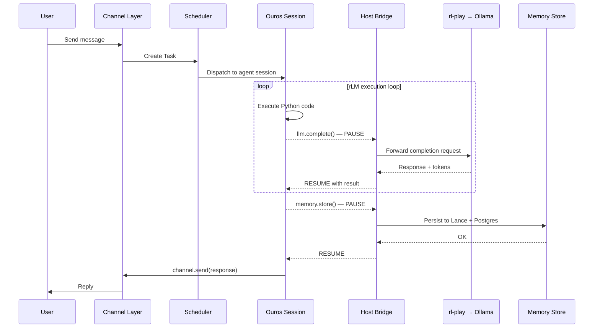
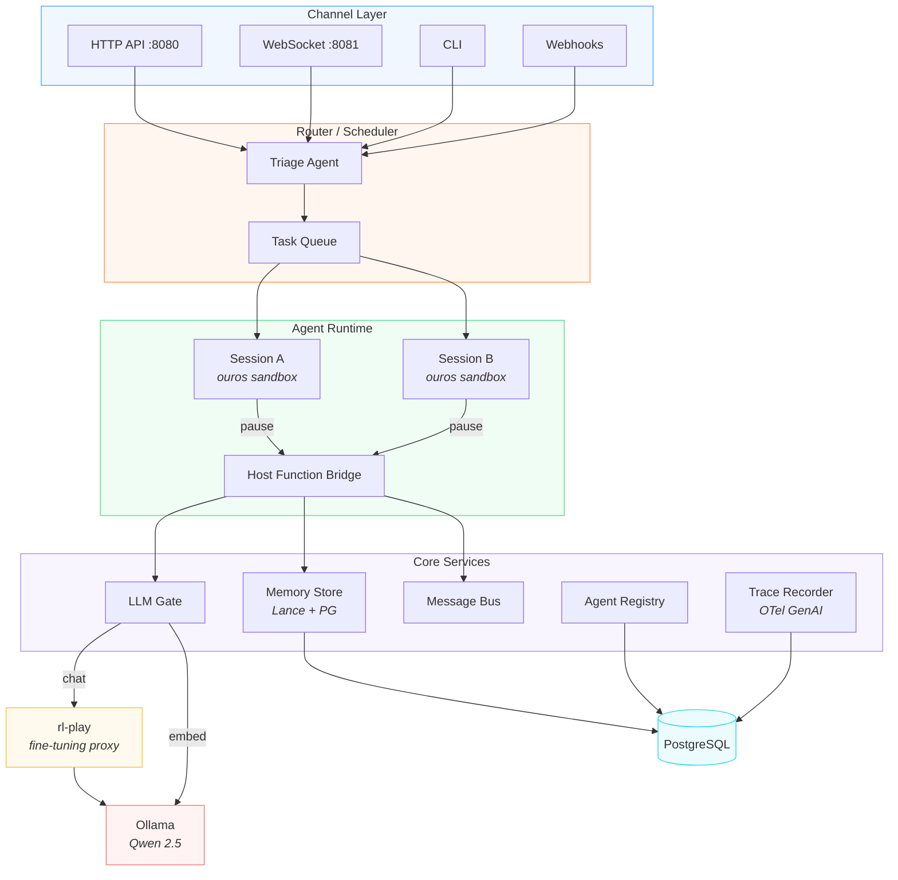
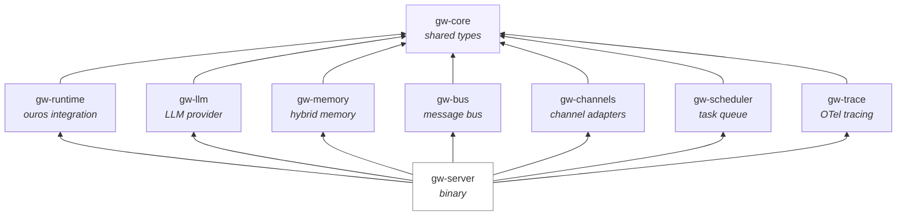
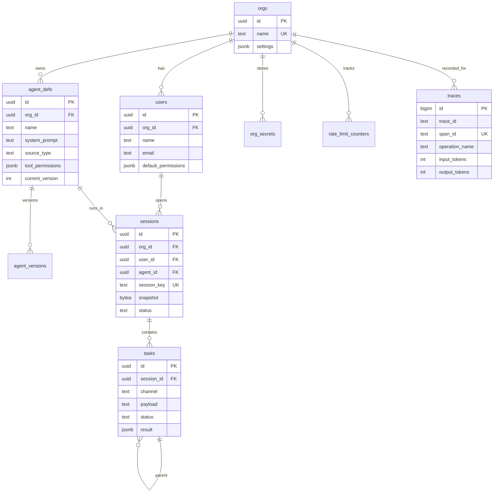
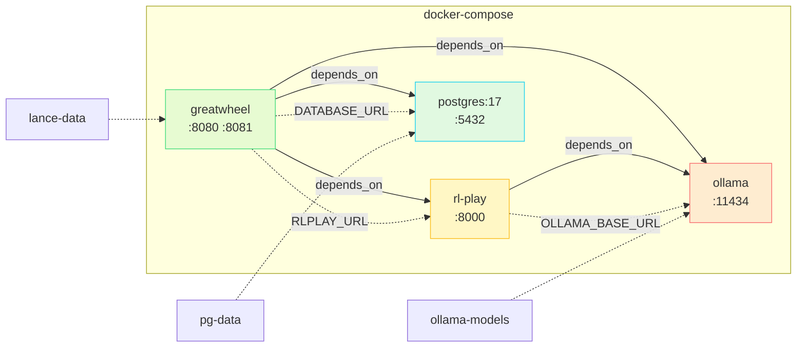
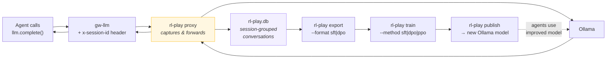

# Greatwheel

An RLM-coordinated agentic runtime where Python agents execute inside sandboxed [ouros](https://crates.io/crates/ouros) sessions, with a Rust core managing memory, routing, and inter-agent communication — multi-tenant, observable, and fine-tunable.

## Core Idea

A **Recursive Language Model** (rLM) is not a special model — it's an inference strategy. The model receives a task but never sees the full context directly. Instead, context lives as Python variables in a sandboxed REPL. The model writes code to search, partition, transform, and recursively sub-query that context.

Ouros gives us the execution substrate: a sandboxed Python runtime that **pauses on external function calls** and produces serializable snapshots. Every host function call (LLM, memory, inter-agent) is a pause point where the Rust runtime takes over.



## Architecture



## Crate Structure



| Crate | Purpose | Key Types |
|-------|---------|-----------|
| `gw-core` | Shared vocabulary | `OrgId`, `UserId`, `Task`, `AgentDef`, `CallContext`, `ToolPermissions` |
| `gw-runtime` | Ouros session management | `SessionManager`, `HostFunctionBridge` |
| `gw-llm` | LLM provider (via rl-play) | `LlmGate`, `OllamaClient`, `CompletionRequest` |
| `gw-memory` | Hybrid search (Lance + PG) | `MemoryStore`, `HybridStore`, `SearchMode` |
| `gw-bus` | Inter-agent communication | `AgentBus` |
| `gw-channels` | Inbound/outbound adapters | `ChannelAdapter` |
| `gw-scheduler` | Task queue + rate limiting | `Scheduler`, `RateLimiter` |
| `gw-trace` | OTel GenAI instrumentation | `TraceRecorder`, `TraceRecord` |
| `gw-server` | Wires everything, serves API | `main()`, config, HTTP routes |

## Data Model



## Docker Topology



## Fine-Tuning Pipeline

All LLM calls flow through **rl-play**, a transparent proxy that captures conversations grouped by session ID:



## Quickstart

**Prerequisites:** Rust (stable), Ollama running locally with a model pulled (`ollama pull qwen2.5:7b`)

```bash
# Run the server (Postgres optional for dev — chat works without it)
cargo run --bin greatwheel -- --config config/greatwheel.toml

# Open the chat UI
open http://localhost:8090
```

**With Docker Compose** (full stack):

```bash
docker compose -f docker/docker-compose.yml up
```

## Development

```bash
# Check all crates compile
cargo check --workspace

# Run tests
cargo test --workspace

# Run with debug logging
RUST_LOG=debug cargo run --bin greatwheel -- --config config/greatwheel.toml
```

### Build Requirements

LanceDB requires `protoc`:

```bash
# Debian/Ubuntu
apt-get install protobuf-compiler

# Or install from release
curl -sL https://github.com/protocolbuffers/protobuf/releases/download/v29.3/protoc-29.3-linux-x86_64.zip -o protoc.zip
unzip protoc.zip -d ~/.local
```

## Project Status

The architecture is defined in [`ARCHITECTURE.md`](ARCHITECTURE.md). Current state:

### Implemented
- [x] Workspace with 9 crates + `gw-bench` and correct dependencies
- [x] Core types — `OrgId`, `Task`, `AgentDef`, `CallContext`, `ToolPermissions`, etc. (`gw-core`)
- [x] Ouros integration — `ReplAgent` with persistent REPL sessions, host function bridge via `HostBridge` trait, `FINAL()` interception, variable injection/retrieval (`gw-runtime`)
- [x] Ollama client — non-streaming, streaming (SSE), optional `think` parameter for reasoning models, model override per call (`gw-llm`)
- [x] HTTP server — Axum with `/api/chat` (streaming SSE), `/api/models`, `/api/config`, `/health` (`gw-server`)
- [x] Chat UI — embedded `chat.html` with dark theme, model selector, system prompt editor, real-time token display
- [x] Hybrid search — BM25s (sparse) + LanceDB/Ollama (dense vector) with RRF fusion, HTTP search server, index builders with resume support (`bench/browsecomp/`)
- [x] BrowseComp-Plus benchmark harness — rLM REPL agent with `search()`, `get_document()`, `llm_query()`, `batch_llm_query()` host functions, multi-run voting, trajectory recording (`gw-bench`)
- [x] Postgres migrations — 5 files: orgs/users, agent_defs/versions, sessions/tasks, traces, secrets/rate_limits
- [x] Docker Compose — 4 services (greatwheel, rl-play, postgres, ollama) + Dockerfiles
- [x] Config — `greatwheel.toml` with server, database, LLM, agents, session sections
- [x] Architecture explorer ([`greatwheel-explorer.html`](greatwheel-explorer.html))

### Trait/type definitions only (no implementation)
- [ ] Hybrid memory as a Rust crate — types defined (`RecallOpts`, `SearchMode`, `MemoryScope`), `MemoryStore` trait defined, no Rust LanceDB/Postgres integration yet (`gw-memory`). Working Python implementation exists in `bench/browsecomp/` (BM25s + LanceDB + RRF fusion)
- [ ] Inter-agent message bus — `AgentBus` trait defined (`call`/`notify`), no concrete implementation (`gw-bus`)
- [ ] Channel adapters — `ChannelAdapter` trait defined, no HTTP/WS/Slack implementations (`gw-channels`)
- [ ] Task scheduler — `Scheduler`/`RateLimiter` structs stubbed, `RateLimitResult` enum defined, no queue or enforcement (`gw-scheduler`)
- [ ] OTel tracing — `TraceRecord` struct defined, no Postgres persistence or OTLP export (`gw-trace`)

### Not started
- [ ] Agent SDK integration — `triage.py` references SDK that doesn't exist yet
- [ ] Agent hot-reload + versioning
- [ ] Session lifecycle (idle timeout → snapshot → evict)
- [ ] Multi-tenancy auth middleware
- [ ] Session key auth model

## License

TBD
